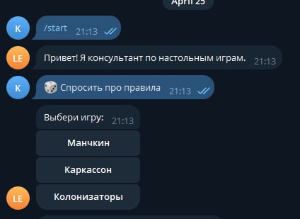

# Руководство пользователя

Бот отвечает на вопросы по правилам настольных игр. 

### Как начать?
1. Запустите бота: нажмите кнопку «START».
2. Выберите интересующую игру из списка.
3. Задайте вопрос.
       

### Как начать диалог по новой игре?
Бот запоминает контекст беседы.
Чтобы сбросить историю, нажмите кнопку «Изменить игру».

### Примеры вопросов:

- «Можно ли играть двумя классами сразу?»
- «Как работает “Убегание”?»
- «Какие карты можно сбросить в бою?»

### Если бот не отвечает

1. Проверьте интернет-соединение.
2. Убедитесь, что вопрос четко сформулирован.
3. Очистите историю (см. выше) и попробуйте снова.

### Поддержка

Если Вы нашли ошибку, сообщите о ней: https://github.com/Papr1ka/BGConsult/issues